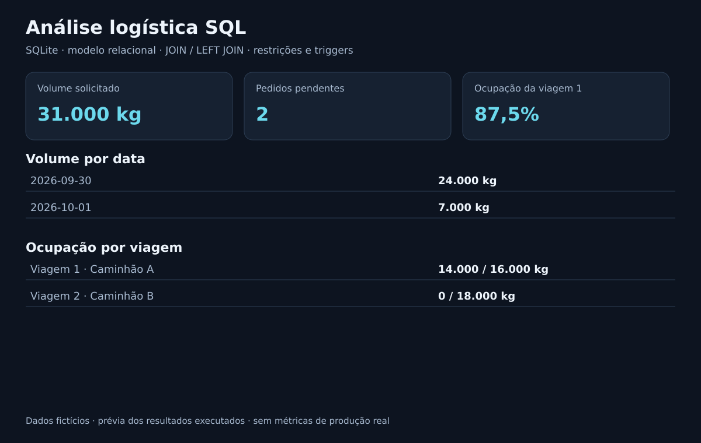
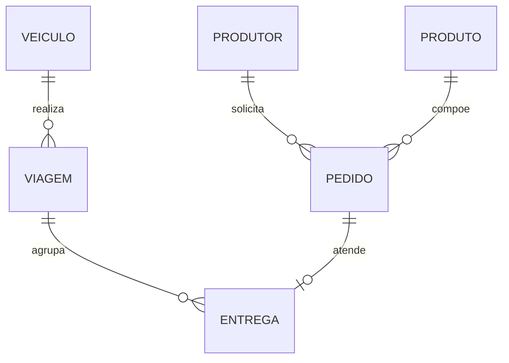

# Análise logística com SQL

[](https://github.com/DiogoLazzarotto/analise-logistica-sql/actions/workflows/tests.yml)

Modelo relacional e consultas para pedidos, produtores, produtos, veículos e entregas. Dados fictícios; projeto demonstrativo.

## Prévia dos resultados



Imagem gerada a partir da execução dos dados fictícios; representa os resultados e regras, sem ser uma captura da interface. Reproduza com `python scripts/generate_preview.py`.

## Executar

Python 3.11+, SQLite incluído no Python:

```bash
python demo.py
python -m unittest discover -s tests -v
```

## Modelo



Chaves e restrições estão em `sql/01_schema.sql`. `pedido_id` único em entrega representa atendimento integral: fracionamento entre viagens não faz parte desta versão. O banco de análise é independente do banco do planejador.

## Consultas e resultados esperados

| Pergunta | Resultado do exemplo |
|---|---|
| Volume solicitado sem cancelamentos | 30/09: 24.000 kg; 01/10: 7.000 kg |
| Pedidos pendentes | Gama: 10.000 kg; Alfa: 7.000 kg |
| Ocupação | Viagem 1: 14.000/16.000 kg, 87,5%; viagem 2: 0% |
| Peso entregue | Alfa: 6.000; Beta: 8.000; Gama: 0 kg |

LEFT JOIN preserva viagens vazias e produtores sem entregas. Índices apoiam filtros de data/status e carga por viagem. Trigger impede inclusão com data divergente, pedido cancelado ou excesso de capacidade.

## Limites

Script analítico com carga fixa; não fornece interface de edição. As validações do trigger se aplicam a INSERT em entrega; alterações diretas em pedidos/viagens exigiriam novas regras antes de usar como sistema operacional. Datas são texto ISO na carga; o schema não valida calendário. Próximos passos: regras de atualização e análise com EXPLAIN QUERY PLAN em volume maior.

## Obter o projeto

```bash
git clone https://github.com/DiogoLazzarotto/analise-logistica-sql.git
cd analise-logistica-sql
```

[Voltar ao perfil](https://github.com/DiogoLazzarotto)

## Verificação automática

O GitHub Actions executa os testes em Python 3.11 e 3.12 em pushes para `main` e pull requests. Também regenera e compara a prévia com o arquivo versionado.
